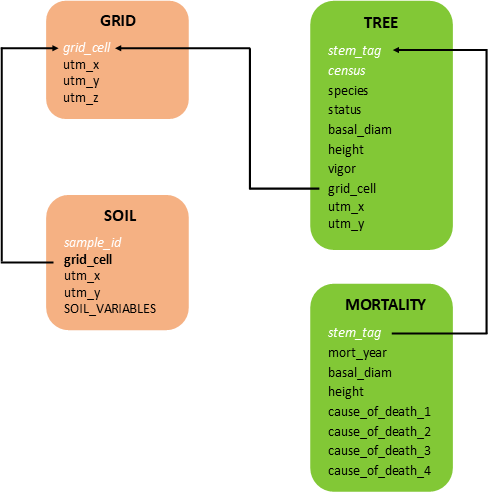
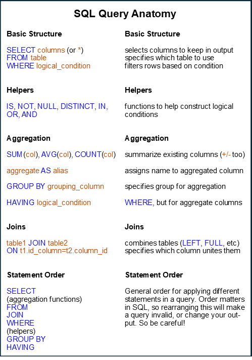

```{r, include=FALSE}
knitr::opts_chunk$set(fig.align = 'center',
                      out.width = '100%')

library(DBI)
library(RSQLite)

con = DBI::dbConnect(RSQLite::SQLite(),'dragons_simple.db')
```

# Intro
First, some basic background information.

## Databases
A relational database is a collection of tabular data **tables** that are *related* to one another by common identifiers called **keys**. The relationships between tables represent actual relationships in real life, and they are only made digitally explicit when the data are stored in a relational database.

<center> 
 
</center>

## SQL
**Structured Query Language:** (*pronounced like "sequel"*) most common language for manipulating data in relational databases and extracting specific information ("querying a database").

Many dialects with slightly different applications (e.g., SQLite, MySQL, PostgreSQL, Oracle).

Most useful for large datasets, where keeping track of everything or loading the entire thing at once becomes difficult. 


## Why?
* 	*Organization/Management* - tables and pseudo-tidy format make data easier to work with
*	*Understanding Relationships* - structure relates data entities in a way that unites different types of data
*	*Storage Size* - minimal redundant info duplicated across tables
*    *Quality Control* - constraints allow further control over data that is valid in different tables and fields


# Standalone Software
For some applications and users, a point-and-click user interface is desired. Standalone desktop software exists to provide this. This is similar to Microsoft Access/Excel or server-based online portals and can be a useful educational tool, since we can easily visualize the database and it various components. 

Let's load some data and explore it using SQLite Studio!

## Exercise 1
Open the `dragons_simple.db` file using the SQLite Studio software. 
View the structure of and data within each table. 
Navigate to the SQL editor (Tools -> Open SQL Editor)

<center> 
 
</center>

## Exercise 2 (work-along)
Now, let's learn some useful statements and syntax in the SQL language!

First, let's try a basic query to give us the species column of the dragons table from the database. 
```{sql connection=con}
SELECT species FROM dragons
```

Now let's get all the columns of the dragons table from the database. 
```{sql connection=con}
SELECT * FROM dragons
```

All rows for adult dragons
```{sql connection=con}
SELECT * FROM dragons WHERE age_class = 'Adult'
```

All rows where sex is missing data
```{sql connection=con}
SELECT * FROM dragons WHERE sex IS NULL
```

Now we'll use the morphometrics table for some practice with aggregating. Let's query the captures tables for the number of dragon captures at the MOA site. 
```{sql connection=con}
SELECT * FROM captures --gives total number in table
```

```{sql connection=con}
SELECT site, COUNT() FROM captures 
GROUP BY site --gives total number in table, grouped by site
```

```{sql connection=con}
SELECT site, COUNT() FROM captures 
GROUP BY site 
HAVING site = 'MOA' --gives total number in table, grouped by site, then filtered to just MOA
```

Join the dragon data to the captures, so we can query to see how many of each species were captured at MOA.
```{sql connection=con}
SELECT site,species,COUNT() FROM captures 
LEFT JOIN dragons ON captures.dragon_id=dragons.dragon_id 
GROUP BY site,species 
Having site = 'MOA' --gives total number in table, grouped by site and species
```

## Exercise 3 (independent)
For this exercise, I would like you to work together to construct a query that puts all this together. Your goal: calculate the average wingspan of "long" dragons (total body length >1000 cm) of each species. Hint: you will need to filter, join, and aggregate all together. 
```{sql connection=con}
SELECT species, AVG(wingspan_cm) FROM dragons
LEFT JOIN morphometrics ON dragons.dragon_id=morphometrics.dragon_id 
WHERE total_body_length_cm > 1000
GROUP BY species
```

```{r, include=FALSE}
dbDisconnect(con)
```


# Commandline Interface with R 
Since many of us will be analyzing our data in R anyway, it might be easier to work with the database right from within R rather than external software. We can do this by using the `DBI` and `RSQLite` packages. These two packages are much more powerful than we have time to discuss here. If you want to learn more, the [documentation](https://rsqlite.r-dbi.org/) is actually very good.


## Exercise 4 (work-along)

First, let's load the packages and establish a connection with our database! This does not *load* the entire database into R memory, just links to the database on your local disk.
```{r}
library(DBI)
library(RSQLite)

dragons_con = DBI::dbConnect()

#NOTE: don't forget to close the connection when you are done! It will stay open as long as the R session is running.
#close with DBI::dbDisconnect()
```

We can get a list of the tables in the database, or the columns in a table
```{r}
dbListTables()

dbListFields()
```

We can read a table from the database right into R's `data.frame` format
```{r}
dragons_df = dbReadTable()
```

... or execute queries in SQL syntax right within R by wrapping it in the `dbGetQuery()` function.
```{r}
dragons_query = dbGetQuery()
```

## Exercise 5 (independent)
For the last exercise, I would like you to try executing some queries and saving the results as `data.frame`s. Bonus points for making the queries more complex and/or using other R tools you are familiar with to work with the data once it is out of the datbase
```{r}
#my_df = dbGetQuery() #fill in your own!
```

## Exercise 6 (BONUS)
To dive a bit further, peruse the documentation for `DBI::dbConnect()` and `DBI::dbWriteTable()` and see if you can create your own SQL database from scratch from within R. (A good option is your data are already in .csv format for your individual tables)

<center> **OR** </center>

Look back at the `.Rmd` for this workshop to see how to use SQL natively within RMarkdown rather than interfacing with `DBI`.

```{r, include=FALSE}
dbDisconnect(con)
```

